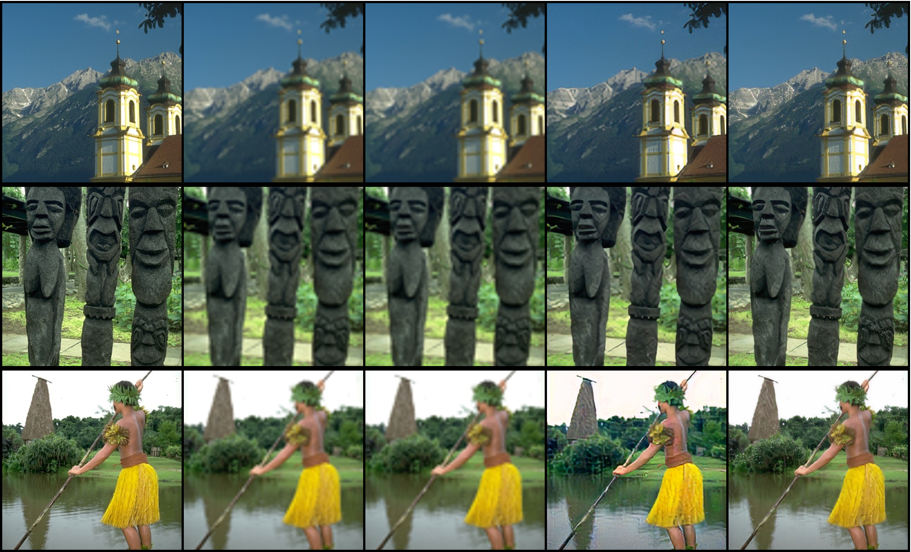

# RDWGAN
Image super resolution with WGAN

 In the field of image super-resolution, models using GAN usually suffer from training instability, thus I decided to use the optimized model WGAN to ensure the stability of the network and avoid gradient disappearance and gradient explosion. The experimental results show that compared with traditional super-resolution methods such as bicubic interpolation, nearest-neighbor interpolation, and SRGAN, the proposed RDWGAN model has superior performance and achieves optimal PSNR scores on Set5, Set14, and Urban100 datasets, respectively. The PSNR scores are optimal on Set5, Set14 and Urban100 datasets, respectively. In the SSIM index, the proposed method gets the highest score on Set5, but does not get the best score on the remaining three datasets, but in terms of visual effect, RDWGAN has the most powerful detail texture generation ability, and does not have the common smearing feeling in the baseline model generated images.
 
* PSNR Score（the higher the score the better the super-resolution image）

| Models  |   Set5    |   Set14   |  BSD100   | Urban100  |
| :-----: | :-------: | :-------: | :-------: | :-------: |
| Bicubic |   26.69   |   23.96   | **24.65** |   21.70   |
| Nearest |   24.61   |   22.65   |   23.73   |   20.73   |
|  SRGAN  |   25.17   |   24.18   |   24.01   |   22.66   |
|  Ours   | **27.30** | **24.29** |   24.12   | **22.79** |

* SSIM Score（the higher the score the better the super-resolution image）

| Models  |    Set5    |   Set14    |   BSD100   |  Urban100  |
| :-----: | :--------: | :--------: | :--------: | :--------: |
| Bicubic |   0.7803   |   0.6816   |   0.6517   |   0.6375   |
| Nearest |   0.7102   |   0.6329   |   0.6145   |   0.5962   |
|  SRGAN  |   0.7513   | **0.6980** | **0.6557** | **0.6962** |
|  Ours   | **0.7873** |   0.6691   |   0.6236   |   0.6882   |

